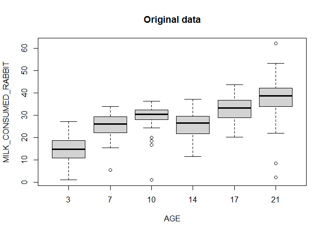

You will find below the code for all the analyses presented in the study of Paës et al, "Establishment of hindgut bacterial ecosystems and acquisition of microbial functions in the infant rabbit: impact of early-life nutrition and polysaccharides ingestion" 
Nomenclature: 
STA- or STAN: rabbits access to solid food enriched in starch from 15 days
STA+ or STAP: rabbits access to solid food enriched in starch from 3 days
RFF+ or RFFP: rabbits access to solid food enriched in rapidly fermentable fibres from 3 days

# Litters description

Description of the feeding behaviour and growth of the 48 rabbit litters studied

## Ingestion pattern

Herein we analyse feeding behaviour of the litters (one litter = 10 rabbits at the beginning of the experiment) before weaning. 

Rabbit milk consumption and solid food ingestion (first with gel food and then with pellets) are studied. In rabbit farming, the ingestion of solid food starts before weaning and becomes predominant in the fourth week after brith

### Milk consumption

The data analyzed were collected from d3 to d21 by weighing the doe before and after nursing

#### Import data and cleaning

Outliers are considered with the rule: mean+/-3*sd (because partial suckling could have accidently occured)


```r
milk<-read.table("Milk_consumption.csv", header=TRUE, sep=";", dec=",")
milk$AGE<-as.factor(milk$AGE)
milk$GROUP<-as.factor(milk$GROUP)
milk$FEMALE<-as.factor(as.character(milk$FEMALE))
milk$MILK_CONSUMED_RABBIT<-as.numeric(as.character(milk$MILK_CONSUMED_RABBIT))

#We delete negative values
milk<-milk[milk[,8]>0,]

#We look for outliers
boxplot(MILK_CONSUMED_RABBIT~AGE, data=milk, main="Original data")
```

<!-- -->

```r
SEmilk<-summarySE(milk, measurevar="MILK_CONSUMED_RABBIT", groupvars=c("AGE"), na.rm=TRUE)
#outliers are considered with the rule mean+/-3*sd because partial suckling could have occured

#threshold inf day 7
b7<-SEmilk[2,3]-3*SEmilk[2,4]

#threshold inf day 10
b10<-SEmilk[3,3]-3*SEmilk[3,4]

#threshold inf day 14
b14<-SEmilk[4,3]-3*SEmilk[4,4]

#threshold inf day 17
b17<-SEmilk[5,3]-3*SEmilk[5,4]

#thresholds day 21
b21n<-SEmilk[6,3]-3*SEmilk[6,4]
b21p<-SEmilk[6,3]+3*SEmilk[6,4]

#outliers considered as missing data
for (k in 1:nrow(milk)) {
  if ((milk[k,10]=="10") & (milk[k,8]<b10)){
    milk[k,8]<-"NA"
  }
}
for (k in 1:nrow(milk)) {
  if ((milk[k,10]=="17") & (milk[k,8]<b17)){
    milk[k,8]<-"NA"
  }
}
for (k in 1:nrow(milk)) {
  if ((milk[k,10]=="21") & (milk[k,8]<b21n)){
    milk[k,8]<-"NA"
  }
}
for (k in 1:nrow(milk)) {
  if ((milk[k,10]=="21") & (milk[k,8]>b21p)){
    milk[k,8]<-"NA"
  }
}
for (k in 1:nrow(milk)) {
  if ((milk$AGE=="7") & (milk[k,8]<b7)){
    milk[k,8]<-"NA"
  }
}

milk$MILK_CONSUMED_RABBIT<-as.numeric(as.character(milk$MILK_CONSUMED_RABBIT))
boxplot(MILK_CONSUMED_RABBIT~AGE, data=milk, main="Cleaned data")
```

<!-- -->

#### Statistics


```r
options(contrasts = c("contr.sum", "contr.poly"))
mod_milk=lme(MILK_CONSUMED_RABBIT~GROUP*AGE, random=~1|FEMALE, data=milk, na.action=na.omit)
mod_milkc<-update(mod_milk,weights=varIdent(form=~1|AGE), method="ML")
#plot(mod_milkc, resid(., type = "p") ~fitted(.), abline = 0) #visual control of residuals aspects
anova(mod_milkc)
```

```
##             numDF denDF  F-value p-value
## (Intercept)     1   190 3532.802  <.0001
## GROUP           2    45    0.333  0.7187
## AGE             5   190  114.236  <.0001
## GROUP:AGE      10   190    1.190  0.3001
```

```r
milk$AGE<-as.factor(milk$AGE)
synth_milk<-summary(MILK_CONSUMED_RABBIT~AGE, method="cross", fun=smean.sd, data=milk)
datatable(synth_milk, colnames=c("Age", "milk consumed (g/rabbit)", "N portees", "NA")) %>% formatRound(columns=c('AGE', 'S', 'N', 'Missing'), digits=1)
```

<!--html_preserve--><div id="htmlwidget-bec9a0eda34830abc2fa" style="width:100%;height:auto;" class="datatables html-widget"></div>
<script type="application/json" data-for="htmlwidget-bec9a0eda34830abc2fa">{"x":{"filter":"none","data":[["1","2","3","4","5","6","7"],["3","7","10","14","17","21","ALL"],[[14.5729166666667,5.57138355494504],[25.3575434782609,5.38415038466927],[29.9905217391304,4.12034891046394],[25.6603829787234,6.1277019401673],[33.2106956521739,4.92422716720126],[44.7941,5.66438158374908],[27.1743992094862,9.57162508607666]],[48,46,46,47,46,20,253],[0,0,1,0,0,27,28]],"container":"<table class=\"display\">\n  <thead>\n    <tr>\n      <th> <\/th>\n      <th>Age<\/th>\n      <th>milk consumed (g/rabbit)<\/th>\n      <th>N portees<\/th>\n      <th>NA<\/th>\n    <\/tr>\n  <\/thead>\n<\/table>","options":{"columnDefs":[{"targets":[1,2,3,4],"render":"function(data, type, row, meta) { return DTWidget.formatRound(data, 1, 3, \",\", \".\"); }"},{"className":"dt-right","targets":[2,3,4]},{"orderable":false,"targets":0}],"order":[],"autoWidth":false,"orderClasses":false}},"evals":["options.columnDefs.0.render"],"jsHooks":[]}</script><!--/html_preserve-->

### Gel consumption

Data from d7 to d17. Data are corrected for water loss (8% of initial gel weight) and already divided by the number of kits inside litters.

#### Statistics daily consumption


```r
intakegel<-read.table("Gel_consumption.csv", header=TRUE, sep=";", dec=",")
intakegel$FEMALE<-as.factor(as.character(intakegel$FEMALE))
intakegel$GROUP<-as.factor(as.character(intakegel$GROUP))
intakegel$AGE<-as.factor(intakegel$AGE)

intakegelselect<-subset(intakegel, GROUP!="STAN")

lme_nest<-lme(GEL_INGESTION_CORRECTED_RABBIT~GROUP*AGE, random=~1|FEMALE, data=intakegelselect, na.action=na.omit)
lme_nest<-update(lme_nest, weights=varIdent(form=~1|AGE), method="ML")
#plot(lme_nid, resid(., type = "p") ~ fitted(.), abline = 0)
anova(lme_nest)
```

```
##             numDF denDF   F-value p-value
## (Intercept)     1   288 224.62577  <.0001
## GROUP           1    29   4.59700  0.0405
## AGE            10   288  75.04641  <.0001
## GROUP:AGE      10   288   4.39663  <.0001
```

```r
a<-emmeans(lme_nest, pairwise ~ GROUP | AGE, adjust="fdr") 
a$contrast
```

```
## AGE = 7:
##  contrast    estimate     SE df t.ratio p.value
##  RFFP - STAP   0.0130 0.0376 29  0.346  0.7318 
## 
## AGE = 8:
##  contrast    estimate     SE df t.ratio p.value
##  RFFP - STAP  -0.0412 0.0404 29 -1.019  0.3165 
## 
## AGE = 9:
##  contrast    estimate     SE df t.ratio p.value
##  RFFP - STAP   0.0516 0.0365 29  1.412  0.1687 
## 
## AGE = 10:
##  contrast    estimate     SE df t.ratio p.value
##  RFFP - STAP   0.1464 0.0480 29  3.048  0.0049 
## 
## AGE = 11:
##  contrast    estimate     SE df t.ratio p.value
##  RFFP - STAP   0.0867 0.0443 29  1.955  0.0603 
## 
## AGE = 12:
##  contrast    estimate     SE df t.ratio p.value
##  RFFP - STAP   0.1299 0.0580 29  2.241  0.0328 
## 
## AGE = 13:
##  contrast    estimate     SE df t.ratio p.value
##  RFFP - STAP   0.2251 0.0705 29  3.192  0.0034 
## 
## AGE = 14:
##  contrast    estimate     SE df t.ratio p.value
##  RFFP - STAP   0.2216 0.0896 29  2.473  0.0195 
## 
## AGE = 15:
##  contrast    estimate     SE df t.ratio p.value
##  RFFP - STAP   0.3214 0.1150 29  2.795  0.0091 
## 
## AGE = 16:
##  contrast    estimate     SE df t.ratio p.value
##  RFFP - STAP   0.3295 0.1072 29  3.072  0.0046 
## 
## AGE = 17:
##  contrast    estimate     SE df t.ratio p.value
##  RFFP - STAP   0.1039 0.1294 29  0.803  0.4286 
## 
## Degrees-of-freedom method: containment
```

#### Total gel ingestion (d7-d17)

The daily ingestion of gels are summed 


```r
#Calculation total ingestion of gel per litter
intakegeltot<-aggregate(intakegel$GEL_INGESTION_CORRECTED_RABBIT, by=list(intakegel$FEMALE, intakegel$GROUP), FUN=sum, na.action=NULL)
names(intakegeltot)<-c("FEMALE", "GROUP", "GEL_INGESTION_CORRECTED_RABBIT")

#Values
summarygel<-summary(intakegeltot$GEL_INGESTION_CORRECTED_RABBIT ~ intakegeltot$GROUP, method="cross", fun=smean.sd)
names(summarygel)<-c("Group", "Missing", "Mean", "SD")

#Statistics
options(contrasts = c("contr.treatment", "contr.poly"))
intakegeltotselect<-subset(intakegeltot, GROUP!="STAN")
modtot<-lm(GEL_INGESTION_CORRECTED_RABBIT~GROUP, data=intakegeltotselect)
# plot(modtot) #ok
# leveneTest(intakegeltot$GEL_INGESTION_CORRECTED_RABBIT, intakegeltot$GROUP) # ok 
Anova(modtot)
```

```
## Anova Table (Type II tests)
## 
## Response: GEL_INGESTION_CORRECTED_RABBIT
##           Sum Sq Df F value   Pr(>F)   
## GROUP     18.098  1  7.7969 0.009498 **
## Residuals 62.673 27                    
## ---
## Signif. codes:  0 '***' 0.001 '**' 0.01 '*' 0.05 '.' 0.1 ' ' 1
```

```r
#Graph boxplot 
intakegeltot$GROUP<-factor(intakegeltot$GROUP, levels = c("STAN", "STAP", "RFFP"))
ggplot(intakegeltot, aes(x=GROUP, y=GEL_INGESTION_CORRECTED_RABBIT)) + geom_boxplot(fill=col) + geom_jitter(shape=16, position=position_jitter(0.1)) + ylab("Total gel intake \n (g of fresh matter/rabbit)") + theme_classic() + scale_color_manual(values=col) + scale_x_discrete(name="", breaks=c("STAN", "STAP", "RFFP"), labels=c("STA-", "STA+", "RFF+")) + theme_classic()+theme(legend.position="right",axis.line=element_line(size = 1, color = "black"), 
                                           axis.ticks.length = unit(.2, "cm"), 
                                           axis.text = element_text( size = 18, color = "black"), 
                                           axis.title = element_text(face="bold", size = 22, color = "black"), 
                                           legend.text = element_text( size = 12), 
                                           legend.title = element_text(face="bold", size = 15), legend.key.height = unit(.7, "cm")) 
```

<!-- -->
